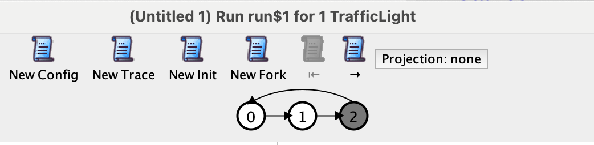

# Alloy and Time

Since version 6, Alloy can also express state evolving over time.
Here is an example of a model that involves time:

```alloy
enum Color { Green, Amber, Red }

sig TrafficLight {
  -- new: var
  var color: Color
}

run {
  all l: TrafficLight | l.color = Green

  -- new: always
  always one t: TrafficLight {
    -- new: the prime symbol '
    t.color = Red implies t.color' = Green else t.color' = t.color.next
  }
} for 1 TrafficLight
```

A model that involves time has the following new elements
that you haven't seen yet:

- Relations or signatures can be declared `var` to indicate that they
  can vary over time.
- The apostrophe, or prime (`'`) is used to indicate the value of a
  relation in the *next time step*.
- New temporal logic keywords. In the example above you can see `always`,
  but there are many others. We will discuss them later, but here are
  the ones you are most likely to use are:
  - `always`: assert that something is true in every time step
  - `eventually`: assert that something is true in at least one time step

Predicates that don't have a temporal keyword associated with them, like
the `all` in the example above, hold in the *first state*, so they are used
for initialization.

In general, a time-based model will look like this:

```alloy
-- Initialize all states
pred init {
  // ...
}

-- Describe how the current state evolves into the next state
pred step {
  // ...
}

run {
  init
  always step
}
```

**EXERCISE**: Run the model of traffic lights above. Use the arrow buttons to
*step through the time steps. Observe the model change over time.

The default scope is (at most) 10 time steps. You can change it by writing
something like `run { ... } for 10..20 steps`.

## The visualizer and time



When you run a model, Alloy will find a *trace*, which is a sequence of
states that evolve over time. At the top of the visualizer, you will
see the sequence of states in the trace and you can use the arrow
buttons to step through it.

Notice that every trace ends in a loop, which indicates that it goes back to a
previous state. This is called a *lasso trace*. That means that a trace has a
*first* state, but it doesn't have a *last* state. This property makes it so that temporal
formulas are always valid; if we didn't have infinite traces, what would the
expression `x'` even refer to in the last state?

You normally don't have to worry about lassos, as long as you make sure that
your model doesn't get "stuck": if there's nothing interesting progress to make
in your model anymore, you at least have to model that the next state is equal
to the previous state, forever.

The visualizer has the following buttons you can use to explore the models
you are generating:

- **New config**: pick a new configuration of (counts of) immutable objects
- **New init**: pick a new initial configuration
- **New trace**: pick a new trace with the same starting configuration
- **New fork**: pick a different possible transition from the current time step

## Things that don't change

In the model we just checked, there was one traffic light and we said that the
traffic light had to make progress in every step (or in fact, what we said was
"exactly one traffic light makes progress in every step", and since there is
only one traffic light that means the one we have has to make progress).

Sometimes we want a bit more arbitrary behavior: in every time
step, perhaps the traffic light changes state or it doesn't.

**EXERCISE**: Change `always one t: TrafficLight` to `always lone t:
TrafficLight`, to say that the traffic light either changes state or
doesn't. Run the model again. Does the output look the same as what you
saw before? Click **new trace** a couple of times to explore different
traces. How long are the traces?

### Forcing interesting states

The first thing you might notice is that the traces are all of a sudden a lot
shorter. The trace of the first model was always 3 steps long, but now you might
find traces of 2 or even 1 step, and then it stops. Why does this happen?

Remeber that Alloy tries to find *any trace* that satisfies the model and can
form a *lasso*. In the system where the traffic light starts at green and it has
to make a change at every time step, the only way to form a lasso is to go
through all states in 3 steps.

But in a system where it is optional to change state, not changing state forever
is a perfectly valid trace, so that's one of the traces you will see generated.

In a system without a lot of constraints, a lot of uninteresting traces are
possible. This might make it harder to find traces in which "interesting" things
happen. So if you want to see "interesting" behavior happen, it is best to
ask for them explicitly.

**EXERCISE**: modify the `run` statement above and add a condition to make sure
that the trace will include a state of where the traffic light is red. You will
need to use a temporal keyword for this. Run the model. Does the light turn red?
If the behavior seems to ignore the specification, don't worry about that just yet.

### Frame conditions

You might notice that in some traces the traffic light switches directly from
`Green` to `Red`, without going through `Amber`. That seems to defy our
specification! What's going on?

Alloy picks all possible states of all possible relations, unless you
specifically restrict it.

Let's look at a simplified version of our expression again. When we say:

```alloy
lone t: TrafficLight | t.color' = t.color.next
```

Then Alloy might pick one `TrafficLight`, and relate the *next state of
`color'`* to the *current state of `color`*. But it's also valid to not pick any
`TrafficLight` at all. In that case, the next state of `color` is not constrained
at all, so Alloy is free to pick any value for the next state of `color`.

So what happens in a trace going directly from `Green` to `Red` is:

- The light starts out in the `Green` state
- no `TrafficLight` is picked for the transition
- Since there is no constraint on `color`, Alloy randomly picks `Red` to be the
  next state of the light.

To prevent "random" picks, we have to always specify fully how the current state
evolves into the next state. That means including restrictions for the *variables
that don't change*.

Restrictions that explicitly state that variables keep the same value are
called *frame conditions*.

**EXERCISE**: add a *frame condition* to the step variable from above,
to make sure that "unpicked" traffic lights don't randomly change state.
Run the model again, and make sure it behaves as you expect. You could run the
model a couple of times and eyeball the output, or you could consider writing a
`check` to make sure the model behaves as expected.

**EXERCISE**: instead of running the model for `1 TrafficLight`, run it
for `2`. Is the way you wrote your frame condition still correct if there is
more than one traffic light?

Frame conditions can be written in a couple of different styles. Here are
a couple of possible conditions you could have used:

```alloy
-- Pick (a set containing) at most one traffic light. All traffic lights in that
-- set change state, and all other ones stay the same.
always some t: lone TrafficLight {
  t.color = Red implies t.color' = Green else t.color' = t.color.next
  all u: TrafficLight - t | u.color' = u.color
}

-- Pick at most one traffic light. The color table in the next time step
-- is the same as the color table in the current time step, with one
-- row replaced.
always some t: lone TrafficLight {
  color' = color ++ t -> (t.color = Red implies Green else t.color.next)
}

-- Constrain all traffic lights: they may either remain the same or change state
-- according to the rules.
always all t: TrafficLight {
  (t.color' = t.color) or (t.color = Red implies t.color' = Green else t.color' = t.color.next)
}
```

We will see an entirely different style of writing frame conditions later
("Reiter-style frame conditions").
