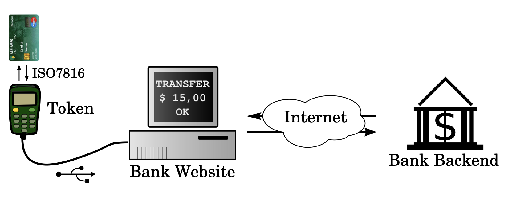
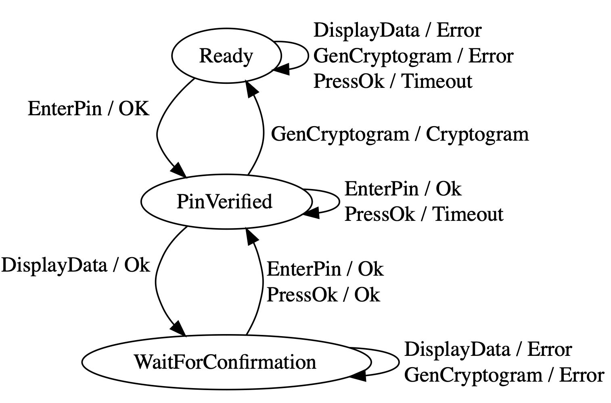

# The e.dentifier

The e.dentifier2 is a smartcard reader for Internet banking, used by the Dutch
bank ABN AMRO.


You may have seen these types of devices before. This particular device connects
to your PC over USB, and responds to commands both from the user and the PC.

The flow is that a user types their PIN number, which is validated by the smart
card and which unlocks the smart card. The PC then sends the reader some data
representing a transaction, which it displays to the user. The user then pushes
the "OK" button, after which it gets the smart card to generate a signature to
confirm the displayed transaction (a "cryptogram" in this protocol). The PC then
sends that cryptogram to the banking server to prove that the user confirmed the
transaction.



All of this work, including the reverse engineering of the state machine of
the e.dentifier, is courtesy of the [Radboud Universiteit Nijmegen](http://www.cs.ru.nl/~joeri/talks/ictopen2012.pdf).

## Modeling the problem

There are a number of ways in which we could model this problem. We could model
the individual behavior of the reader and the smart card as Threads or Actors,
like we did for [Challenge Fourteen](challenge-fourteen.md).

In this case we're going to do something a bit simpler: the team from Radboud
Universiteit has figured out the state machine of the combined system of Reader
and Smart Card by automatically probing it. We are going to model the state machine:



## Translating to Alloy

Let's put down some data structures to hold the state of our system:

```alloy
-- The states of the E.dentifier
enum State { Ready, PinVerified, WaitForConfirmation }
-- The events that can happen, both from the Human as well as the PC
enum Event { HumanEnterPin, HumanPressOk, PcDisplayData, PcGenCryptogram }
-- The signals that the E.dentifier sends to the PC
enum Output { Ok, Error, Timeout, Cryptogram }

-- One global object to hold all states
one sig Edentifier {
  var state: State,
  var event: Event,
  var output: Output,
}
```

The next question is how we are going to model the state transition table.
A state transition table has 3 or 4 columns:

- The current state
- The input (event)
- The next state
- The output (signal to the PC)

```admonish tip title="Exercise"
Think about how you would represent the state transition table
in Alloy. There are a couple of different ways you could do it: you could write
one or more `pred`s to represent valid combinations of these 4 elements, or a
`fun` that represents a set of 4-tuples. Write a couple of transitions in your
mechanism of choice.
```

-------

We ended up representing the transitions as a giant table of 4-tuples. This is
an elegant way of representing the table, but it has one downside: all
0-argument functions will automatically be represented in the visualizer, so we
will see a bunch of lines when we visualize the model! In the *Theme* settings
of the visualizer, we will have to turn off visualizing `$transitions`.


```alloy
fun transitions: set State -> Event -> State -> Output {
   Ready -> PcDisplayData -> Ready -> Error
+ Ready -> PcGenCryptogram -> Ready -> Error
+ Ready -> HumanPressOk -> Ready -> Timeout
+ Ready -> HumanEnterPin -> PinVerified -> Ok
+ PinVerified -> PcDisplayData -> WaitForConfirmation -> Ok
+ PinVerified -> HumanEnterPin -> PinVerified -> Ok
+ PinVerified -> HumanPressOk -> PinVerified -> Timeout
+ PinVerified -> PcGenCryptogram -> Ready -> Cryptogram
+ WaitForConfirmation -> HumanEnterPin -> PinVerified -> Ok
+ WaitForConfirmation -> HumanPressOk -> PinVerified -> Ok
+ WaitForConfirmation -> PcDisplayData -> WaitForConfirmation -> Error
+ WaitForConfirmation -> PcGenCryptogram-> WaitForConfirmation -> Error
}

-- Check that there is a row in the table for every combination of
-- State and Event
check TransitionsTableIsComplete {
  // ...
}
```

```admonish tip title="Exercise"
It is a good exercise to add validations into your model
to make sure you didn't forget anything. Complete the `check` above
that ensures that the table is complete; that is, there is a row in
it for every combination of state and input.
```

## Running the state machine

Let's write some predicates that we'll use to run the state machine:

```alloy
-- Set up the initial state of the state machine
pred init {
  // ...
}

-- Make the state machine perform one step according its current state and
-- current event.
pred step {
  // ...
}

-- Running the state machine means setting it up and then performing a step
-- at every time step.
pred runStateMachine {
  init
  always step
}

-- Test the predicates above. Run the state machine, and expect to find it
-- in some particular state at some point
run {
  runStateMachine
  eventually { Edentifier.state = WaitForConfirmation }
}
```

```admonish tip title="Exercise"
Complete the `init` and `step` predicates above to initialize
the state machine and make it perform a step, respectively. Variables you don't
constrain will vary across all possible values, which can be useful! Decide
on what you want `output` to represent: the response to the *current* event,
or the response to *previous* time step's event.
```

## Checking for useful properties

A desirable behavior of a smart card reader like this would seem to be that
no signing code can be generated unless a user enters their PIN code, sees
the transaction and presses the OK button.

```alloy
check UserConfirmationIsRequiredForAllCryptograms {
  runStateMachine => {
    // ...
  }
}
```

```admonish tip title="Exercise"
Complete the condition above which checks that the user
is involved in the generation of cryptograms. Try checking the system, does it
satsify the requirement? Think about the time operators you want to use here.
Here are your choices:
```

- Future time operators
  - `always P`: P is true in the current and all future states
  - `eventually P`: P is true in at least one current or future state
  - `after P`: P is true in the next state
  - `P until Q`: P is true zero or more times and then Q is true
  - `Q releases P`: P can only be false after Q is true (maybe Q never happens)
- Past time operators
  - `historically P`: P is true in the current and all past states
  - `once P`: P is true in at least one current or past state
  - `before P`: P is true in the previous state
  - `P since Q`: Q was true once and then P was true until the current state
  - `Q triggered P`: ...

-----------

The e.dentifier is vulnerable to a hijacked PC: if the PC software sends a
`PcGenCryptogram` event after the smart card has been unlocked, the display and
confirmation can be bypassed.

```admonish tip title="Exercise"
If you want, design a state machine that prevents this behavior.
```
